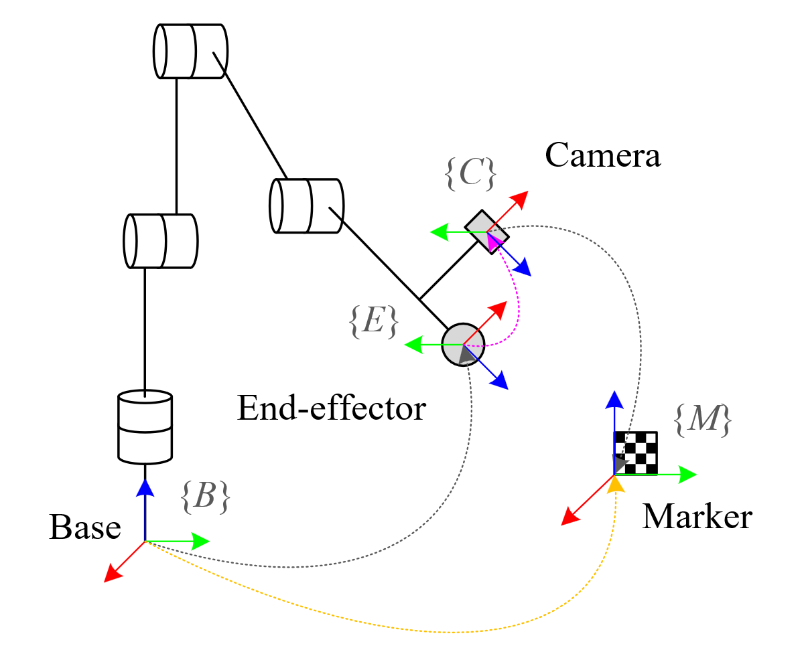
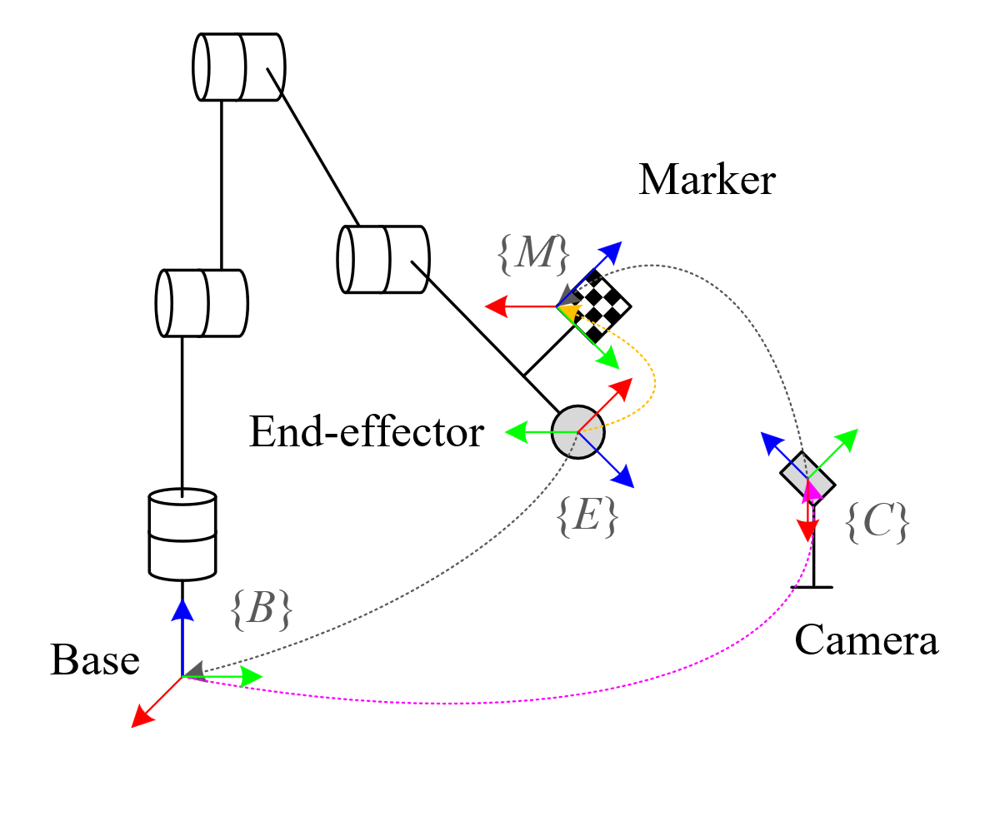

# Minimal Hand-Eye Calibration Node for ROS 2
The `minimal_handeye_ros2` package offers a minimal hand-eye calibration node for ROS 2, featuring:
- **Capture** of transformation data using TF.
- **Solutions** to both _eye-in-hand_ and _eye-to-hand_ calibration problems.
- **Output** of calibration results in multiple formats including _homogeneous transformation matrix, rotation matrix, quaternion, roll-pitch-yaw_.
- (Optional) **Broadcasting** of calibration results to TF.

Comparison of this package with the popular [`easy_handeye`](https://github.com/IFL-CAMP/easy_handeye):

| Feature |   easy_handeye  |   minimal_handeye_ros2 |
| ------- | --------------- | ---------------------- |
| ROS Version | Originally developed for ROS 1, there is a [ROS 2 port](https://github.com/marcoesposito1988/easy_handeye2) but development is slow | ROS 2 |
| Solver | OpenCV's implementation of the [Tasi-Lenz algorithm](https://doi.org/10.1109/70.34770) | Self-implemented solver based on the [paper by Faugeras and Hebert, 1986](https://doi.org/10.1177/027836498600500302) |
| GUI | Yes | No. Uses ROS 2 commandline interfaces for interaction |
| Autonomous Robot Movement | Yes | No |

For details on the self-implemented solver, please refer to the [PDF documentation](https://github.com/zixingjiang/minimal_handeye_ros2/blob/jazzy/doc/handeye.pdf).

## Hand-Eye Calibration

This package supports two types of hand-eye calibration problems: _eye-in-hand_ and _eye-to-hand_.

| Eye-in-hand calibration             |  Eye-to-hand calibration             |
| ----------------------------------- | ------------------------------------ |
|         |          |
| Goal: solve the transformation from robot end-effector frame to twist-mounted camera frame  |  Goal: solve the transformation from robot base frame to external camera frame  |

## Prerequisites
This package assumes that the _TF between the **robot base** frame and the **robot end-effector** frame_ and the _TF between the **camera** frame and **marker** frame_ are being published. If the TFs are not available, the node will crash when you attempt to capture transformation data.

## Getting Started
1. **Clone this package in your workspace**. Taking `~/handeye_ws` as an example:
    ```bash
    mkdir -p ~/handeye_ws/src
    cd ~/handeye_ws/src
    git clone https://github.com/zixingjiang/minimal_handeye_ros2.git
    ```
2. **Install dependencies**.
    ```bash
    cd ~/handeye_ws
    rosdep update --rosdistro=$ROS_DISTRO
    sudo apt update
    rosdep install --from-paths ./ -i -y --rosdistro ${ROS_DISTRO}
    ```
3. **Build the package**.
    ```bash
    colcon build
    ```
4. **Run the calibration node**. You can specify the calibration type, robot base frame, robot end-effector frame, camera frame, and marker frame as parameters. Please check [this table](#parameters) for more details.
    ```bash
    source install/setup.bash
    
    # Fill the parameters with your setup
    ros2 run minimal_handeye_ros2 handeye_calibration_node --ros-args \
      -p calibration_type:=eye-to-hand \
      -p robot_base_frame:=<robot_base_frame> \
      -p robot_ee_frame:=<robot_ee_frame> \
      -p camera_frame:=<camera_frame> \
      -p marker_frame:=<marker_frame> \
      -p broadcast_tf:=true 
    ```
5. **Capture transformation data**. Move the robot to different poses and capture transformation data using the following `ros2service` call:
    ```bash
    ros2 service call /calibrate std_srvs/srv/Trigger
    ```
    For each service call, the node will query the TF tree for transformation data and check if the data is valid. When more than two valid data points are collected, the node will automatically calculate the hand-eye calibration at every service call. </br>
    **Note**: Please ensure the TF data is stable and robot is still when triggering each capture.</br>
    **Note**: Please make sure that two adjacent robot poses have **different rotations**.

6. **Check the calibration results**. When a converged calibration result is obtained (usually 6 valid data points are required), the node will output the calibration result in the server log and the client service response message. If you have set `broadcast_tf:=true`, the calibration result will also be broadcasted to TF.

## Parameters
| Parameter | Description | Default Value |
| --------- | ----------- | ------------- |
| `calibration_type` | Type of hand-eye calibration, options: `eye-to-hand`, `eye-in-hand` | `eye-to-hand` |
| `robot_base_frame` | TF frame name for the robot base | `robot_base_frame` |
| `robot_ee_frame` | TF frame name of the robot end-effector | `robot_ee_frame` |
| `camera_frame` | TF frame name of the camera | `camera_frame` |
| `marker_frame` | TF frame name of the marker  | `marker_frame` |
| `broadcast_tf` | Whether to broadcast the calibration result to TF, options: `true`, `false`| `false` |

## Gimbal Lock
For the roll-pitch-yaw output, when the pitch angle is &plusmn;90 degrees (approximately &plusmn;1.5707 radians), the roll and yaw angles are not unique due to the [gimbal lock](https://en.wikipedia.org/wiki/Gimbal_lock). In this case, the roll and yaw angles are set to zero to avoid ambiguity.